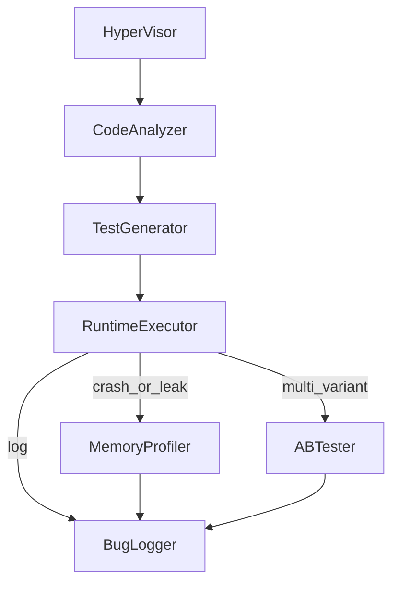

# BugHunter Swarm — реализация и чеклист

Этот файл дублирует **чеклист** из плана BHS и фиксирует, что уже есть в репозитории.

## DAG (Mermaid)

В коде: [`src/bhs/graph.py`](../src/bhs/graph.py), входная нода `hypervisor_init`.

## Чеклист (отслеживание)

### Фундамент и состояние

- [x] **StateObject / схема состояния** — [`src/bhs/state.py`](../src/bhs/state.py) (`BHSState`, `BugSchema`, `HypervisorResponse`)
- [x] **HyperVisor routing** — [`src/bhs/hypervisor/router.py`](../src/bhs/hypervisor/router.py) (квоты, retry-хелперы, `build_hypervisor_response`)
- [x] **Персистентность state** — SQLite [`src/bhs/persistence/sqlite_store.py`](../src/bhs/persistence/sqlite_store.py); Redis-клиент [`redis_cache.py`](../src/bhs/persistence/redis_cache.py) (опционально)
- [x] **Артефактное хранилище** — [`src/bhs/storage/artifacts.py`](../src/bhs/storage/artifacts.py) (локально + MinIO), retention helper

### Песочница и безопасность

- [x] **Ephemeral контейнеры** — [`src/bhs/sandbox/docker_runner.py`](../src/bhs/sandbox/docker_runner.py) (Docker SDK / CLI, `no-new-privileges`, `network none`)
- [x] **cgroups** — через флаги `--memory`, `--cpus` (Docker/Podman); детальные лимиты в `sandbox_limits`
- [x] **seccomp** — опционально через `BHS_SECCOMP_PROFILE`, см. [`docker/seccomp/README.md`](../docker/seccomp/README.md)
- [x] **Лимиты выполнения** — `cpu_seconds`, OOM-эвристика в результате sandbox
- [x] **Локальный режим** — `BHS_SANDBOX_MODE=local` (subprocess, без контейнера) для CI

### Граф оркестрации

- [x] **Каркас DAG** — LangGraph [`src/bhs/graph.py`](../src/bhs/graph.py)
- [x] **MVP-цепочка** — `hypervisor_init` → `code_analyzer` → `test_generator` → `runtime_executor` → `bug_logger`
- [x] **Условные ветки** — `memory_profiler`, `ab_tester`
- [ ] **Полный feedback-loop** до convergence — заготовки `route_feedback` в [`pipeline.py`](../src/bhs/nodes/pipeline.py); по умолчанию один проход (`max_iterations`)

### Ноды и инструменты

- [x] **CodeAnalyzerNode** — AST Python: `SyntaxError`, bare `except` ([`pipeline.py`](../src/bhs/nodes/pipeline.py))
- [x] **TestGeneratorNode** — смоук-тест в `.bhs/generated/`
- [x] **RuntimeExecutorNode** — `python -m compileall` в sandbox
- [x] **MemoryProfilerNode** — эвристика по логам
- [x] **ABTesterNode** — `scipy.stats.ttest_ind` при `ab_metric_samples` и ≥2 вариантах
- [x] **BugLoggerNode** — dedup, bounty, Markdown, черновики GitHub ([`buglogger/`](../src/bhs/buglogger/))

### Наблюдаемость и CI

- [x] **OpenTelemetry** — OTLP HTTP [`otel.py`](../src/bhs/observability/otel.py)
- [x] **Prometheus** — счётчики нод, histogram длительности; HTTP `expose.py`
- [x] **Audit trail** — SQLite `audit_log`
- [x] **CI** — [`.github/workflows/bug-hunter.yml`](../.github/workflows/bug-hunter.yml)
- [x] **K8s Job (черновик)** — [`deploy/k8s/bug-hunter-job.yaml`](../deploy/k8s/bug-hunter-job.yaml)

### Документы и промпт

- [x] **Системный промпт** — [`docs/prompts/hypervisor_system_v1.txt`](prompts/hypervisor_system_v1.txt)
- [x] **JSON-контракт** — `HypervisorResponse` + поле `last_hypervisor` в финальном состоянии

---

## Оставшаяся работа (backlog)

Ниже — что по смыслу **ещё не доведено** до уровня из исходного плана BHS (сверх уже сделанного MVP).

### Оркестрация и HyperVisor

- [ ] **Feedback-loop в графе**: ребро `bug_logger` → `test_generator` (или отдельная нода), критерии **convergence** / лимит итераций, перенос гипотез и метрик в следующий цикл
- [ ] **Retry/fallback в DAG**: использовать `should_retry_node` / `reduce_scope` из [`router.py`](../src/bhs/hypervisor/router.py) при падении `runtime_executor`, а не только хелперы «вне графа»
- [ ] **Параллельные ветки** графа (несколько репо/вариантов одновременно) и **conflict resolution** при конфликтующих выводах нод
- [ ] **Планировщик квот**: жёсткая остановка при `QuotaExceeded` с переходом в `finalize`/`abort` и отчётом

### Состояние и хранилища

- [ ] **PostgreSQL** (или иной RDBMS) для durable state вместо/рядом с SQLite для прод-нагрузки
- [ ] **Redis**: блокировки на `run_id`, кэш AST/отчётов, очередь задач — сейчас только опциональная запись метаданных в [`cli.py`](../src/bhs/cli.py)
- [ ] **LangGraph checkpointing** (SQLite/Postgres) для возобновляемых прогонов после сбоя

### Песочница и безопасность

- [ ] **Явные лимиты CPU** (`--cpus` / `NanoCpus` в Docker SDK), **tmpfs/размер диска** в контейнере, политика **SIGSEGV** (core dump в артефакты + reduced scope)
- [ ] **Политика shell**: whitelist команд, «approve» для произвольного shell, запись патчей только в согласованные пути (аналог `/tmp/patches`)
- [ ] **Готовый seccomp JSON** в репо (или скрипт генерации), а не только ссылка в README
- [ ] **AppArmor/SELinux** профили при жёстких требованиях

### Ноды и инструменты

- [ ] **CodeAnalyzer**: tree-sitter, CFG/DFG, Semgrep/CodeQL, линтеры по языку, bandit/trivy, экспорт полноценного **HypothesisSet** под fuzz/property-based
- [ ] **TestGenerator**: `hypothesis`/property-based, цели для AFL++/libFuzzer, mutation (Stryker/Mutmut), LLM-guided синтез (опционально)
- [ ] **RuntimeExecutor**: прогон реального **pytest**/тест-сьюта, **coverage**, опционально `strace`/OTel внутри контейнера, chaos (сеть/диск)
- [ ] **MemoryProfiler**: Valgrind/heaptrack/pprof/`memory_profiler`, корреляция **file:line** по стекам, а не только эвристика по логам
- [ ] **ABTester**: одинаковые **seeds**, нагрузка (k6/Locust), **confidence intervals** / effect size, **rollback** при деградации > threshold
- [ ] **BugLogger**: дедуп по **embeddings** (порог ~0.85), CVSS через библиотеку/калькулятор, экспорт **PDF**, автосоздание GitHub Issue (не только черновики), Jira webhook/REST по конфигу

### Наблюдаемость и эксплуатация

- [ ] **Grafana**: дашборды как код + datasource Prometheus/Loki из коробки
- [ ] **Логи в Loki**: structured logging из BHS (не только поднятый контейнер Loki в compose)
- [ ] **Интеграция OTel** с родительскими span’ами вокруг каждого sandbox-запуска (сейчас — в основном ноды)

### Масштаб и CI

- [ ] **Argo Workflows / K8s Jobs**: шаблон под реальный образ с установленным `bhs`, volume с репо, секреты
- [ ] **CI**: кэш зависимостей, сборка sandbox-образа, интеграционный прогон с Docker (без только `local`)
- [ ] **GitLab CI** (зеркало workflow), при необходимости — кэш артефактов MinIO

### Качество и «умная» часть

- [ ] **Нагрузочные тесты** гипервизора (таймауты, квоты, деградация)
- [ ] **Тюнинг FP rate**, fuzz entropy, **VectorStore** успешных гипотез и классов багов (как в промпте)

### Документация

- [ ] **PlantUML**-версия DAG (опционально), runbook для операторов (seccomp, MinIO, Redis)
