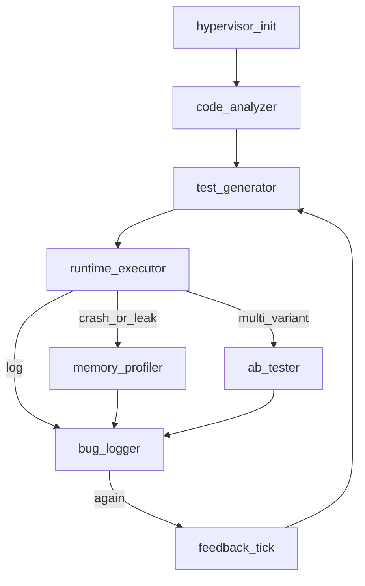

# BugHunter Swarm — реализация и чеклист

Этот файл дублирует **чеклист** из плана BHS и фиксирует, что уже есть в репозитории.

## DAG (Mermaid)

В коде: [`src/bhs/graph.py`](../src/bhs/graph.py), входная нода `hypervisor_init`; условный выход после `bug_logger` — [`route_feedback`](../src/bhs/nodes/pipeline.py) (`again` → `feedback_tick` → снова `test_generator`, иначе `END`).

## Чеклист (отслеживание)

### Фундамент и состояние

- [x] **StateObject / схема состояния** — [`src/bhs/state.py`](../src/bhs/state.py) (`BHSState`, `BugSchema`, `HypervisorResponse`)
- [x] **HyperVisor routing** — [`src/bhs/hypervisor/router.py`](../src/bhs/hypervisor/router.py) (квоты, retry-хелперы, `build_hypervisor_response`)
- [x] **Персистентность state** — SQLite [`src/bhs/persistence/sqlite_store.py`](../src/bhs/persistence/sqlite_store.py); Redis-клиент [`redis_cache.py`](../src/bhs/persistence/redis_cache.py) (опционально)
- [x] **Артефактное хранилище** — [`src/bhs/storage/artifacts.py`](../src/bhs/storage/artifacts.py) (локально + MinIO), retention helper

### Песочница и безопасность

- [x] **Ephemeral контейнеры** — [`src/bhs/sandbox/docker_runner.py`](../src/bhs/sandbox/docker_runner.py) (Docker SDK / CLI, `no-new-privileges`, `network none`)
- [x] **cgroups** — через флаги `--memory`, `--cpus` (Docker/Podman); детальные лимиты в `sandbox_limits`
- [x] **seccomp** — опционально через `BHS_SECCOMP_PROFILE`, см. [`docker/seccomp/README.md`](../docker/seccomp/README.md)
- [x] **Лимиты выполнения** — `cpu_seconds`, OOM-эвристика в результате sandbox
- [x] **Локальный режим** — `BHS_SANDBOX_MODE=local` (subprocess, без контейнера) для CI

### Граф оркестрации

- [x] **Каркас DAG** — LangGraph [`src/bhs/graph.py`](../src/bhs/graph.py)
- [x] **MVP-цепочка** — `hypervisor_init` → `code_analyzer` → `test_generator` → `runtime_executor` → `bug_logger`
- [x] **Условные ветки** — `memory_profiler`, `ab_tester`
- [x] **Полный feedback-loop** — [`src/bhs/graph.py`](../src/bhs/graph.py): `bug_logger` → `route_feedback` → `feedback_tick` → `test_generator` при `next_action=spawn_agent`; лимит **`max_iterations`** / `BHS_MAX_ITERATIONS`; ранний **`finalize`** при **`BHS_STOP_BUG_COUNT`** и достаточном числе dedupe-багов в [`bug_logger_node`](../src/bhs/nodes/pipeline.py)
- [x] **Квота CPU под длинные прогоны** — `BHS_SANDBOX_CPU_BUDGET_SECONDS` или авто `max(120, 3 * max_iterations)` через [`Settings.resolved_sandbox_cpu_seconds`](../src/bhs/config.py) в [`cli.py`](../src/bhs/cli.py)

### Ноды и инструменты

- [x] **CodeAnalyzerNode** — AST Python: `SyntaxError`, bare `except` ([`pipeline.py`](../src/bhs/nodes/pipeline.py))
- [x] **TestGeneratorNode** — смоук-тест в `.bhs/generated/`
- [x] **RuntimeExecutorNode** — `python -m compileall` в sandbox
- [x] **MemoryProfilerNode** — эвристика по логам
- [x] **ABTesterNode** — `scipy.stats.ttest_ind` при `ab_metric_samples` и ≥2 вариантах
- [x] **BugLoggerNode** — dedup, bounty, Markdown, черновики GitHub ([`buglogger/`](../src/bhs/buglogger/)); учёт `Settings` для раннего выхода по числу багов

### Наблюдаемость и CI

- [x] **OpenTelemetry** — OTLP HTTP [`otel.py`](../src/bhs/observability/otel.py)
- [x] **Prometheus** — счётчики нод, histogram длительности; HTTP `expose.py`
- [x] **Audit trail** — SQLite `audit_log`
- [x] **CI** — [`.github/workflows/bug-hunter.yml`](../.github/workflows/bug-hunter.yml)
- [x] **K8s Job (черновик)** — [`deploy/k8s/bug-hunter-job.yaml`](../deploy/k8s/bug-hunter-job.yaml)

### Документы и промпт

- [x] **Системный промпт** — [`docs/prompts/hypervisor_system_v1.txt`](prompts/hypervisor_system_v1.txt)
- [x] **JSON-контракт** — `HypervisorResponse` + поле `last_hypervisor` в финальном состоянии

---

## LLM / Ollama, bootstrap и Docker

- [x] **Переменные `BHS_OLLAMA_*`** — [`src/bhs/config.py`](../src/bhs/config.py), по умолчанию модель `gemma3:1b`
- [x] **HTTP-клиент Ollama** — [`src/bhs/llm/ollama.py`](../src/bhs/llm/ollama.py), `/api/chat`, fallback на смоук-тест
- [x] **Bootstrap** — [`src/bhs/dev_bootstrap.py`](../src/bhs/dev_bootstrap.py): Ollama compose, observability, сборка sandbox-образа; пути — [`paths.py`](../src/bhs/paths.py)
- [x] **Docker Compose для Ollama** — [`deploy/docker-compose.llm.yml`](../deploy/docker-compose.llm.yml)
- [x] **Корневой compose приложения** — [`docker-compose.yml`](../docker-compose.yml) + образ [`docker/bhs/Dockerfile`](../docker/bhs/Dockerfile), `include` LLM и observability
- [x] **`BHS_REPO_PATH` / `resolve_run_repo`** — цель анализа из env, см. [`cli.py`](../src/bhs/cli.py)
- [x] **Пример env** — [`.env.example`](../.env.example), гайд [docs/ENVIRONMENT.md](ENVIRONMENT.md)

---

## Оставшаяся работа (backlog)

Ниже — что по смыслу **ещё не доведено** до уровня из исходного плана BHS (сверх уже сделанного MVP).

### Оркестрация и HyperVisor

- [x] **Feedback-loop в графе**: `bug_logger` → условный переход → `feedback_tick` → `test_generator`; лимит `max_iterations` ([`graph.py`](../src/bhs/graph.py))
- [ ] **Retry/fallback в DAG**: использовать `should_retry_node` / `reduce_scope` из [`router.py`](../src/bhs/hypervisor/router.py) при падении `runtime_executor`, а не только хелперы «вне графа»
- [ ] **Параллельные ветки** графа (несколько репо/вариантов одновременно) и **conflict resolution** при конфликтующих выводах нод
- [x] **Планировщик квот (MVP)**: `check_quotas` в начале и после шага `runtime_executor` — при превышении `QuotaExceeded` переход к `finalize` и `status=partial` ([`pipeline.py`](../src/bhs/nodes/pipeline.py))

### Состояние и хранилища

- [ ] **PostgreSQL** (или иной RDBMS) для durable state вместо/рядом с SQLite для прод-нагрузки
- [ ] **Redis**: блокировки на `run_id`, кэш AST/отчётов, очередь задач — сейчас только опциональная запись метаданных в [`cli.py`](../src/bhs/cli.py)
- [ ] **LangGraph checkpointing** (SQLite/Postgres) для возобновляемых прогонов после сбоя

### Песочница и безопасность

- [x] **Лимиты CPU в Docker/Podman** — `sandbox_limits.cpu_cores`, `--cpus` / `nano_cpus` ([`docker_runner.py`](../src/bhs/sandbox/docker_runner.py)); `BHS_SANDBOX_CPU_CORES` в [`config.py`](../src/bhs/config.py) попадает в начальное состояние в [`cli.py`](../src/bhs/cli.py)
- [ ] **tmpfs/размер диска** в контейнере, политика **SIGSEGV** (core dump в артефакты + reduced scope)
- [ ] **Политика shell**: whitelist команд, «approve» для произвольного shell, запись патчей только в согласованные пути (аналог `/tmp/patches`)
- [ ] **Готовый seccomp JSON** в репо (или скрипт генерации), а не только ссылка в README
- [ ] **AppArmor/SELinux** профили при жёстких требованиях

### Ноды и инструменты

- [ ] **CodeAnalyzer**: tree-sitter, CFG/DFG, Semgrep/CodeQL, линтеры по языку, bandit/trivy, экспорт полноценного **HypothesisSet** под fuzz/property-based
- [x] **TestGenerator (LLM MVP)**: синтез pytest через **Ollama** при `BHS_OLLAMA_ENABLED=true`; property-based / mutation — post-MVP
- [ ] **RuntimeExecutor**: прогон реального **pytest**/тест-сьюта, **coverage**, опционально `strace`/OTel внутри контейнера, chaos (сеть/диск)
- [ ] **MemoryProfiler**: Valgrind/heaptrack/pprof/`memory_profiler`, корреляция **file:line** по стекам, а не только эвристика по логам
- [ ] **ABTester**: одинаковые **seeds**, нагрузка (k6/Locust), **confidence intervals** / effect size, **rollback** при деградации > threshold
- [ ] **BugLogger**: дедуп по **embeddings** (порог ~0.85), CVSS через библиотеку/калькулятор, экспорт **PDF**, автосоздание GitHub Issue (не только черновики), Jira webhook/REST по конфигу

### Наблюдаемость и эксплуатация

- [ ] **Grafana**: дашборды как код + datasource Prometheus/Loki из коробки
- [ ] **Логи в Loki**: structured logging из BHS (не только поднятый контейнер Loki в compose)
- [ ] **Интеграция OTel** с родительскими span’ами вокруг каждого sandbox-запуска (сейчас — в основном ноды)

### Масштаб и CI

- [ ] **Argo Workflows / K8s Jobs**: шаблон под реальный образ с установленным `bhs`, volume с репо, секреты
- [ ] **CI**: кэш зависимостей, сборка sandbox-образа, интеграционный прогон с Docker (без только `local`)
- [ ] **GitLab CI** (зеркало workflow), при необходимости — кэш артефактов MinIO

### Качество и «умная» часть

- [ ] **Нагрузочные тесты** гипервизора (таймауты, квоты, деградация)
- [ ] **Тюнинг FP rate**, fuzz entropy, **VectorStore** успешных гипотез и классов багов (как в промпте)

### Документация

- [ ] **PlantUML**-версия DAG (опционально)
- [x] **Runbook окружения** — [docs/ENVIRONMENT.md](ENVIRONMENT.md), [README](../README.md), [.env.example](../.env.example); bootstrap, итерации, корневой compose; seccomp/MinIO/Redis — [docker/seccomp/README.md](../docker/seccomp/README.md) и `deploy/docker-compose.*`
